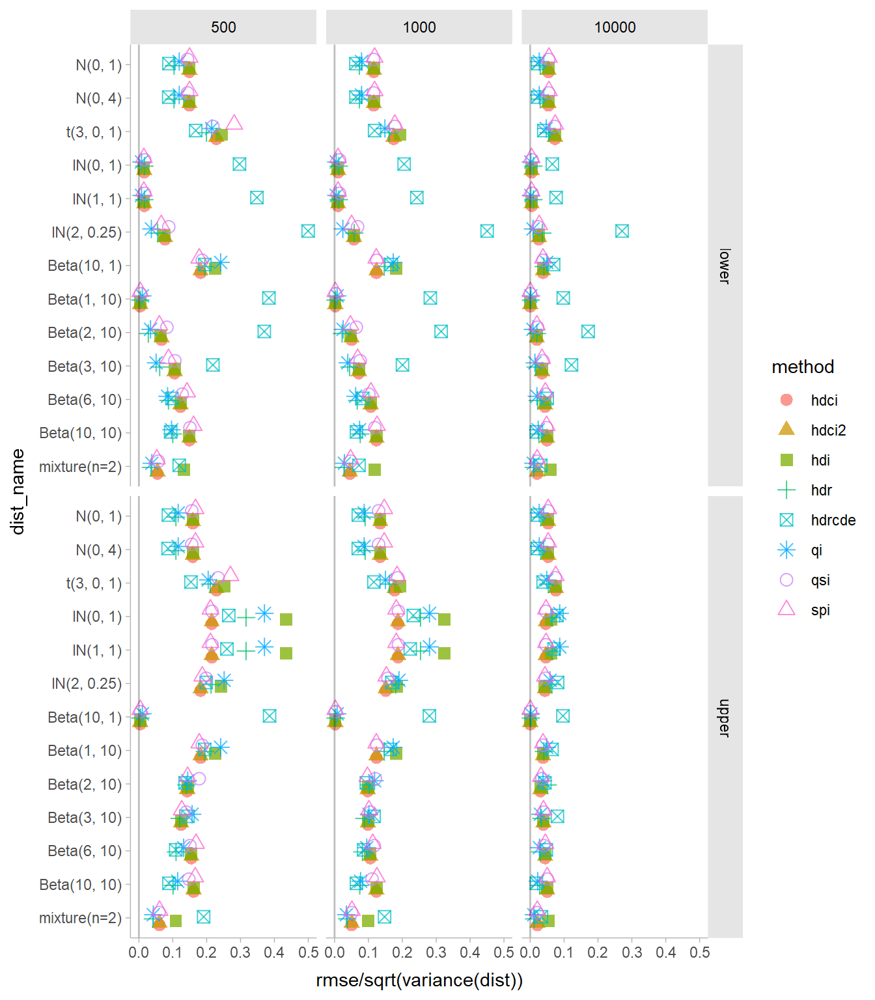
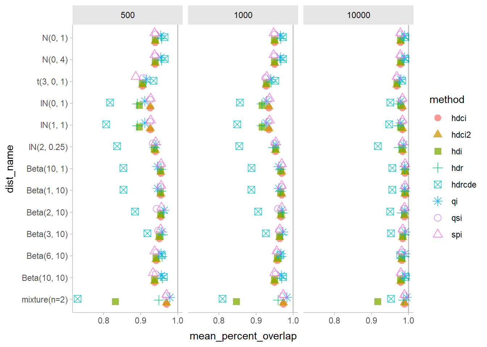

Comparing interval estimators
================
Matthew Kay
2022-07-02

## Setup

Libraries:

``` r
library(distributional)
library(ggdist)
library(bayestestR)
library(dplyr)
library(tidyr)
library(ggplot2)
library(purrr)
library(sets)

theme_set(theme_ggdist())
dir.create("sims", showWarnings = FALSE)

cache = function(expr, file) {
  if (file.exists(file)) {
    readRDS(file)
  } else {
    saveRDS(expr, file)
    expr
  }
}
```

Some helper functions for pulling out intervals:

``` r
lower = function(x) UseMethod("lower")

lower.hdr = function(x) {
  vapply(vctrs::field(x, "lower"), min, numeric(1))
}

lower.list = function(x) {
  vapply(x, `[[`, numeric(1), "CI_low")
}

upper = function(x) UseMethod("upper")

upper.hdr = function(x) {
  vapply(vctrs::field(x, "upper"), max, numeric(1))
}

upper.list = function(x) {
  vapply(x, `[[`, numeric(1), "CI_high")
}
```

## Distributions to test

The distributions we’ll test on:

``` r
dist = c(
  dist_normal(0, 1:2),  # as a check: rmse/sd on N(0,1) and N(0,2) should be the same
  dist_student_t(3, 0, 1),
  dist_lognormal(c(0,1,2), c(1,1,0.5)),
  dist_beta(10, 1),  # as a check: rmse on lower and upper on beta(1,10) should be similar to upper and lower on beta(10,1)
  dist_beta(c(1,2,3,6,10), 10)
)

tibble(dist) |>
  ggplot(aes(xdist = dist)) +
  stat_slab(aes(color = format(dist)), fill = NA, normalize = "panels") +
  facet_wrap(~ family(dist), scales = "free")
```


## Generate data

We’ll generate 100 samples of each sample size from each distribution
using a fixed set of seeds:

``` r
grid = expand.grid(
  dist = dist,
  n = c(1000, 10000),
  seed = 1:100
) |>
  as_tibble() |>
  mutate(
    sample = mapply(\(dist, seed, n) withr::with_seed(seed, generate(dist, n)), dist, seed, n),
    true_hdi = distributional::hdr(dist),
    true_hdi_lower = lower(true_hdi),
    true_hdi_upper = upper(true_hdi)
  ) |>
  select(-true_hdi) |>
  cache("sims/grid.rds")
```

## Calculate intervals

Calculate HDCIs

``` r
list_of_intervals = \(lower, upper) {
  mapply(reals, lower, upper, SIMPLIFY = FALSE)
}

hdci_df = grid |>
  mutate(
    est_interval = lapply(sample, bayestestR::hdi),
    est_lower = lower(est_interval),
    est_upper = upper(est_interval),
    method = "hdci",
    true_interval = list_of_intervals(true_hdi_lower, true_hdi_upper),
    est_interval = list_of_intervals(est_lower, est_upper)
  ) |>
  rename(
    lower = true_hdi_lower,
    upper = true_hdi_upper
  ) |>
  select(-sample) |>
  cache("sims/hdci_df.rds")
```

Calculate HDCIs using the implementation as in HDInterval (via ggdist):

``` r
hdci2_df = grid |>
  mutate(
    est_interval = lapply(sample, ggdist::hdci),
    est_lower = vapply(est_interval, min, numeric(1)),
    est_upper = vapply(est_interval, max, numeric(1)),
    method = "hdci2",
    true_interval = list_of_intervals(true_hdi_lower, true_hdi_upper),
    est_interval = list_of_intervals(est_lower, est_upper)
  ) |>
  rename(
    lower = true_hdi_lower,
    upper = true_hdi_upper
  ) |>
  select(-sample) |>
  cache("sims/hdci2_df.rds")
```

Calculate HDIs. Note we have to take the lower limit of the lower
interval (resp. upper limit of upper interval) as there may be multiple
intervals per sample:

``` r
matrices_to_intervals = \(matrices) {
  lapply(matrices, \(m) as.interval(apply(m, 1, \(x) reals(x[[1]], x[[2]]))))
}

hdi_df = grid |>
  mutate(
    est_interval = lapply(sample, ggdist::hdi),
    est_lower = vapply(est_interval, min, numeric(1)),
    est_upper = vapply(est_interval, max, numeric(1)),
    method = "hdi",
    true_interval = list_of_intervals(true_hdi_lower, true_hdi_upper),
    est_interval = matrices_to_intervals(est_interval)
  ) |>
  rename(
    lower = true_hdi_lower,
    upper = true_hdi_upper
  ) |>
  select(-sample) |>
  cache("sims/hdi_df.rds")
```

Calculate SPIs:

``` r
spi_df = grid |>
  mutate(
    est_interval = lapply(sample, bayestestR::spi),
    est_lower = lower(est_interval),
    est_upper = upper(est_interval),
    method = "spi",
    true_interval = list_of_intervals(true_hdi_lower, true_hdi_upper),
    est_interval = list_of_intervals(est_lower, est_upper)    
  ) |>
  rename(
    lower = true_hdi_lower,
    upper = true_hdi_upper
  ) |>
  select(-sample) |>
  cache("sims/spi_df.rds")
```

Calculate QIs:

``` r
qi_df = grid |>
  mutate(
    est_interval = lapply(sample, bayestestR::eti),
    est_lower = lower(est_interval),
    est_upper = upper(est_interval),
    method = "qi",
    lower = quantile(dist, 0.025),
    upper = quantile(dist, 0.975),
    true_interval = list_of_intervals(lower, upper),
    est_interval = list_of_intervals(est_lower, est_upper)
  ) |>
  select(-sample, -true_hdi_lower, -true_hdi_upper) |>
  cache("sims/qi_df.rds")
```

Calculate HDRs using method from hdrcde:

``` r
hdrcde_df = grid |>
  mutate(
    est_interval = lapply(sample, \(x) matrix(hdrcde::hdr(x, prob = 95)$hdr, byrow = TRUE, ncol = 2)),
    est_lower = vapply(est_interval, min, numeric(1)),
    est_upper = vapply(est_interval, max, numeric(1)),
    method = "hdrcde",
    true_interval = list_of_intervals(true_hdi_lower, true_hdi_upper),
    est_interval = matrices_to_intervals(est_interval)
  ) |>
  rename(
    lower = true_hdi_lower,
    upper = true_hdi_upper
  ) |>
  select(-sample) |>
  cache("sims/hdrcde_df.rds")
```

Calculate HDRs using method from distributional:

``` r
hdr_df = grid |>
  mutate(
    est_interval = distributional::hdr(dist_sample(sample)),
    est_lower = lower(est_interval),
    est_upper = upper(est_interval),
    method = "hdr",
    true_interval = list_of_intervals(true_hdi_lower, true_hdi_upper),
    est_interval = matrices_to_intervals(mapply(cbind, 
      vctrs::field(est_interval, "lower"), vctrs::field(est_interval, "upper"), SIMPLIFY = FALSE
    ))
  ) |>
  rename(
    lower = true_hdi_lower,
    upper = true_hdi_upper
  ) |>
  select(-sample) |>
  cache("sims/hdr_df.rds")
```

## Comparing methods

As a simple comparison, we’ll look at the root-mean-squared error of
both interval limits compared to their true values. We scale the RMSE by
the standard deviation of the distribution just for comparison purposes
(as some of these distributions have quite different scales):

``` r
dist_names = format(dist)

bind_rows(
  hdi_df,
  hdci2_df,
  hdci_df,
  hdr_df,
  hdrcde_df,
  qi_df,
  spi_df
) |>
  group_by(method, dist, n) |>
  summarise(
    lower = sqrt(mean((est_lower - lower)^2)),
    upper = sqrt(mean((est_upper - upper)^2)), 
    .groups = "drop"
  ) |>
  # enforce a sensible display order on dist names
  mutate(dist_name = factor(format(dist), levels = rev(dist_names))) |>
  pivot_longer(c(lower, upper), names_to = "limit", values_to = "rmse") |>
  ggplot(aes(x = rmse / sqrt(variance(dist)), y = dist_name, color = method, shape = method)) +
  geom_point(alpha = 0.75, size = 3, position = position_dodge(width = 0.5)) +
  geom_vline(xintercept = 0, alpha = 0.25) +
  facet_grid(limit ~ n) +
  scale_shape_manual(values = c(scales::shape_pal()(6), 1))
```



The “true” instance of an interval (actually set of intervals) for a
given distribution and interval type (e.g. quantile interval,
highest-density interval (set), or shortest interval) is some subset of
,
.
Each interval estimator yields an estimate
,
expressed as a set of disjoint intervals
![\\left\\{\[L_1, U_1\], \\dots\\right\\}](https://latex.codecogs.com/png.image?%5Cdpi%7B110%7D&space;%5Cbg_white&space;%5Cleft%5C%7B%5BL_1%2C%20U_1%5D%2C%20%5Cdots%5Cright%5C%7D "\left\{[L_1, U_1], \dots\right\}").
Given the sum of the widths of those intervals (i.e. the Lesbegue
measure of the set of intervals,
),
the percent overlap of the estimated interval set and the true interval
set is:

 = \frac{l(I \cap \hat{I})}{l(I \cup \hat{I})}
")

This has the advantage (compared to just comparing lower and upper
endpoints) that it generalizes to estimators that return multiple
intervals.

We can calculate the percent overlap for all interval estimates with
their true interval:

``` r
percent_overlap = \(x, y) {
  map2_dbl(x, y, \(x, y) interval_measure(interval_intersection(x, y)) / interval_measure(interval_union(x,y)))
}

overlap_df = bind_rows(
  hdi_df,
  hdci2_df,
  hdci_df,
  hdr_df,
  hdrcde_df,
  qi_df,
  spi_df
) |>
  mutate(percent_overlap = percent_overlap(true_interval, est_interval)) |>
  cache("sims/overlap_df.rds")
```

And compare:

``` r
overlap_df |>
  group_by(method, dist, n) |>
  summarise(
    mean_percent_overlap = mean(percent_overlap),
    .groups = "drop"
  ) |>
  mutate(dist_name = factor(format(dist), levels = rev(dist_names))) |>
  ggplot(aes(x = mean_percent_overlap, y = dist_name, color = method, shape = method)) +
  geom_point(alpha = 0.75, size = 3, position = position_dodge(width = 0.5)) +
  geom_vline(xintercept = 1, alpha = 0.25) +
  facet_grid( ~ n) +
  scale_shape_manual(values = c(scales::shape_pal()(6), 1))
```


